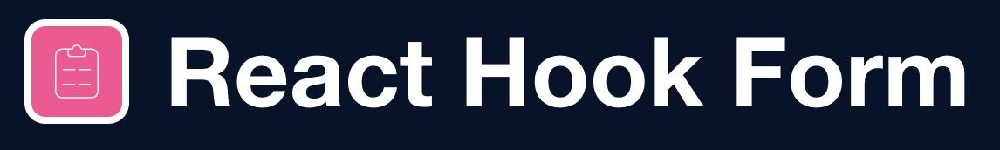
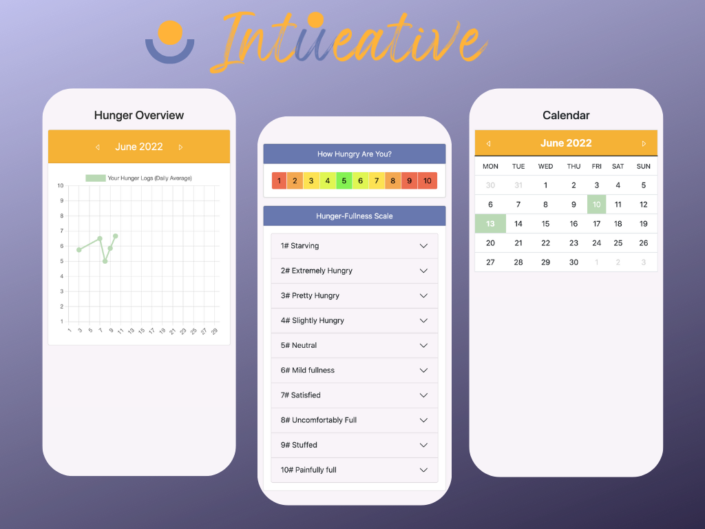
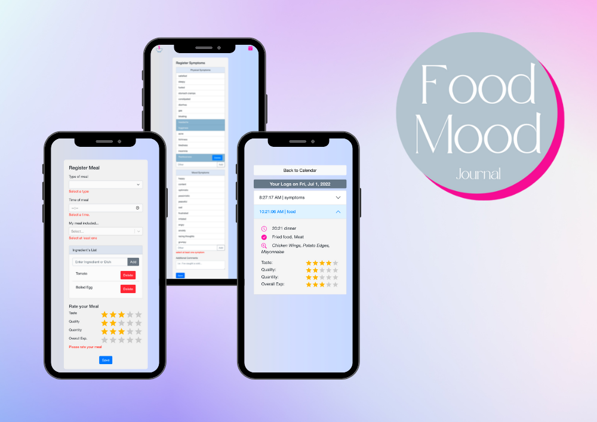
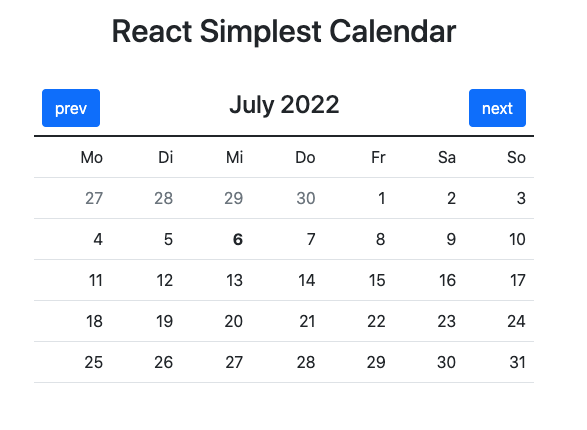
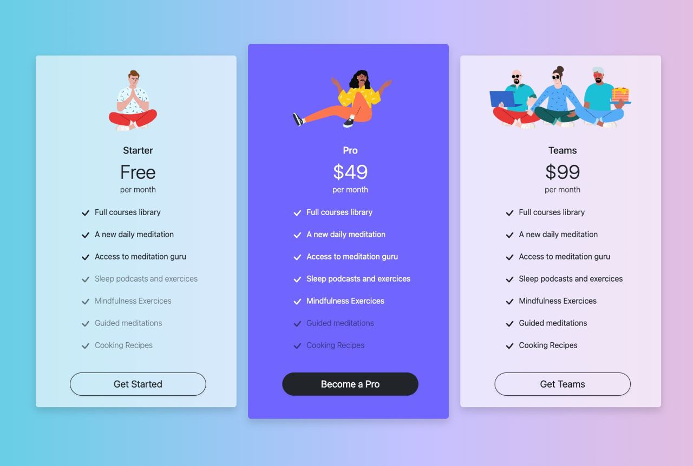

<h1 align="center">Hi, it's Ruth !</h1>

* Made in Barcelona
* On summer 2021 I commited to become a Web Developer and slowly :snail:  but steadily :muscle: I'm getting closer to that goal everyday. 
* After finishing a 580h bootcamp with focus on VueJS, I wanted to check out other frameworks and that's when I fell for the combo ReactJS + Typescript.
* I am very thankful :pray: for having an experienced Sofware Engineer [/kruschid](https://github.com/kruschid) as my mentor, turning my learning process into something very enriching.

 

<h2 align="center">About Me</h2>

* **I am often...** sipping matcha latte :tea: while coding and brainstorming for new projects. 
* **I am currently learning...** as much as I can about ReactJS & Typescript.
* **Next I'd like to learn...** more about UX.
* **My ideal projects...** are those that can improve people's lives, specially healthy/sustainable lifestyle and nutrition related.

 
<h2 align="center">My Latest Projects  </h2>

*(Click on the image to access ReadMe)*

---
 

|  |   |
|-----------------------------------------------------------------|------------------------------------------------|
| [IntUeative](https://intueative.netlify.app/)                   | [FoodMood Journal](https://foodmoodjournal.netlify.app/) |
| Check in with your body signals and identify your hunger levels | Register your meals and symtoms in detail   | 

|    |  
|-------------------------------------------|-------------------------------------------------------------------------------------
| [react-simplest-calendar](https://www.npmjs.com/package/react-simplest-calendar) | [Oh-My-Shop](https://oh-my-shop.netlify.app/) 
|  Highly customizable component for React.                      | Online Shop with Full user flow simulation
| [demo](https://ruthtempo.github.io/react-simplest-calendar/)   | Register, Login, Add and Remove from Cart & Favorites

||
|-------------|
|[Responsive and Animated Pricing Plans](https://pricing-plans-jump2digital.netlify.app/) |
| Created for a hackaton challenge |
                                                          
                                                                 
 
 <h1 align="center">Blog Posts</h1>
 
 
 * [Create a collapsible Floating Action Button with React](https://dev.to/ruthtempo/create-a-collapsible-floating-action-button-with-react-iee)
 
 * [How to add dynamic routing to your react single page application](https://dev.to/ruthtempo/how-to-add-dynamic-routing-to-your-react-single-page-application-flm)

